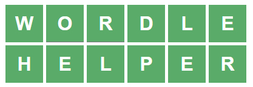
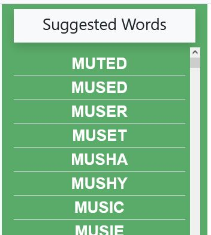
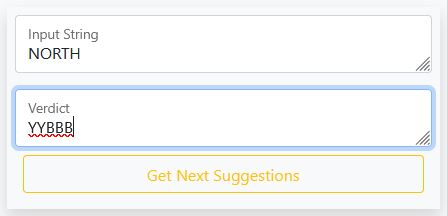
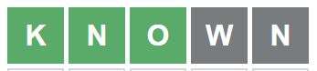
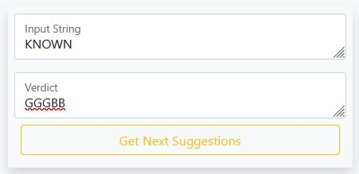

[Go To Site](https://tamimehsan.github.io/Hello-Wordle/)

<h1>Welcome fellow travellers!</h1>
    <h4>Guess the WORDLE in 6 tries. Each guess must be a valid 5 letter word. Hit the enter button to submit. After each guess, the color of the tiles will change to show how close your guess was to the word.</h4>
    

    <h4>
        Skip the long boring talk and go straight to game
    </h4>
    <a href="game.html" class="btn btn-lg btn-warning">Go To Game</a>
    

    <h5 style="text-align: left">
        But not everyone have good vocab skill like me. So, here's a small cheat. Use it like below
    </h5>
    

    <h5 style="text-align: left">You can find word suggestions on the right panel. Which will be updated according to inputs.</h5>
      
    

    <h5 style="text-align: left">Input any word you like either by yourself or from suggestion into the main WORDLE site</h5>
      
    

    <h5 style="text-align: left">
        Then on this site input the given string in the first text box.  
        And the verdict (represented by color) in the second text box.  
        Here,  
        G = Green [Means the right letter is in right place]  
        Y = Yellow [Means the letter is somewhere in the word]  
        B = Grey or Black [Means the letter is not in the word]
    </h5>
     
    

    <h5 style="text-align: left">
        Here another word is given whose first 3 letters are green but the last two are black
    </h5>
     
    

    <h5 style="text-align: left">
        So, The verdict here will be "GGGBB"
    </h5>
     
    

    <h4>So, Let's get cracking</h4>
    <a href="game.html" class="btn btn-lg btn-warning">Go To Game</a>
